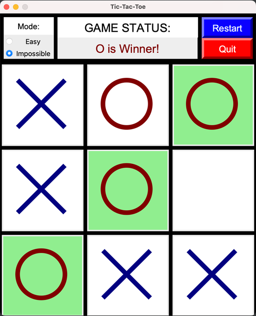
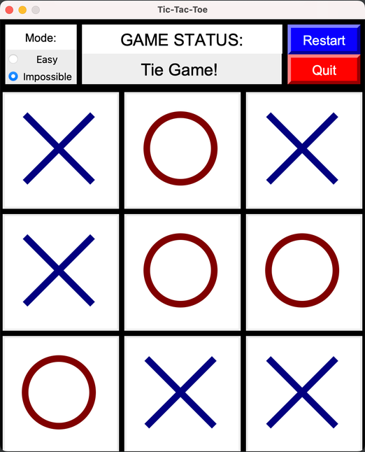
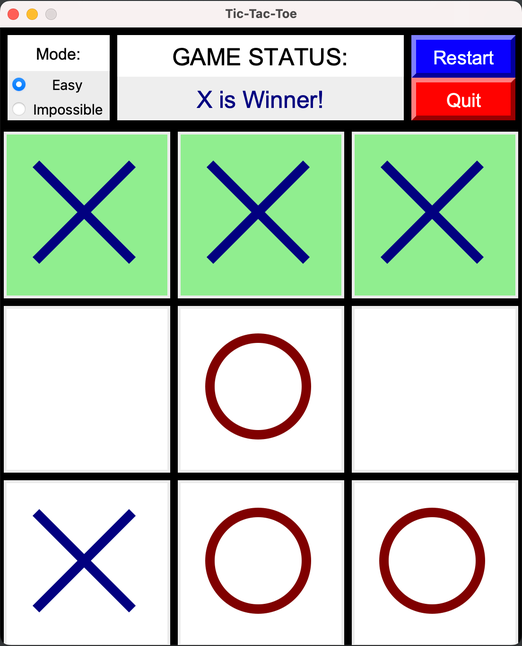

# Tic-Tac-Toe
GUI Tic-Tac-Toe game using Python and tkinter with two game modes: Impossible (AI) and Easy (randomization).
Player moves first in this game and is "X", while computer moves second and is "O."

**Impossible mode:**
Uses the recursive minimax algorithm to find the optimal move for the computer.
User can only lose or tie in this game mode, and cannot win.

**Player loss:**

**Player tie:**

**Easy mode:**
Randomizes computer moves based on empty squares on game board.
User can either win, lose, or tie in this game mode.

**Player win:**

